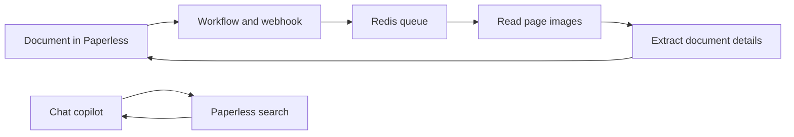

# Paperless AI

**From a scanned page to an answer you can verify.** [paperless-ngx](https://github.com/paperless-ngx/paperless-ngx) imports and searches documents. This project adds AI reading for difficult scans, automatic organization, and a browser chat copilot without changing Paperless itself.

- **Read:** a vision model transcribes selected pages and saves the text in Paperless.
- **Organize:** a text model extracts a title, date, sender, and summary.
- **Ask:** the copilot searches Paperless, reads matching documents, and answers with citations.

Paperless workflows and tags start the work. A webhook listener puts document IDs in Redis; Python workers process them and write results back through the Paperless API. The stack runs with Docker Compose, PostgreSQL stores Paperless and chat data, and [Arize Phoenix](https://phoenix.arize.com/) records traces and evaluations. Models can run through OpenRouter or an OpenAI-compatible local server such as Ollama or vLLM.

The copilot uses Paperless's existing full-text search, so there is no separate vector index. If local model serving is offline, queued documents wait for it to return.

The default cloud models receive document content; see [privacy details and local model options](docs/reference.md#privacy).

## Setup

This Compose deployment assumes an existing Traefik network, Paperless data volumes, and the sibling [container hardening baseline](https://github.com/Enucatl/docker-compose-security-baseline). See the [setup guide](docs/setup.md) for prerequisites, secrets, Paperless workflows, startup, backfills, model selection, and upgrades.

## Reference

- [Architecture, data flow, and privacy](docs/reference.md#architecture-and-data-flow)
- [Configuration and Docker secrets](docs/reference.md#configuration)
- [Daily operations and correspondent cleanup](docs/reference.md#operations)
- [Testing and model evaluation](docs/reference.md#testing-and-evaluation)
- [Repository layout](docs/reference.md#repository-layout)

For the project story and design tradeoffs, read the [case study](docs/index.md) and [deep dive](docs/deep-dive.md).
