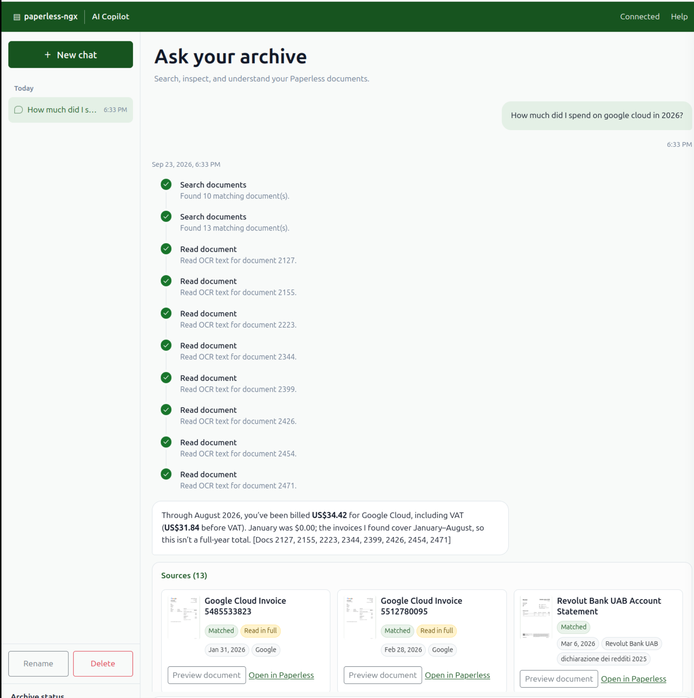

# docker-paperless-ai



AI OCR, metadata extraction, and chat for [paperless-ngx](https://github.com/paperless-ngx/paperless-ngx) — no source patches required.

Documents are ingested through a two-stage AI pipeline (OCR → metadata extraction) driven by Paperless tags and a Redis queue. Selected pages are re-OCRd with a vision LLM, then a text LLM extracts metadata. The chat copilot searches Paperless full text directly with concise keywords.

The always-on `ai` service exposes the browser copilot and runs OCR/metadata
queue workers. The internal `webhook-listener` receives Paperless events and
enqueues document IDs in Redis.

For a portfolio-oriented explanation of the architecture, Jev-based model
evaluation, keyword search, and production tradeoffs, see
[case study](docs/index.md).


## What is paperless-ngx?

paperless-ngx is a free, open-source document management system. It allows you
to digitize, organize, and search your physical documents. You drop scanned
documents (PDFs, images) into a watch folder, and paperless-ngx automatically
extracts text, metadata, and performs OCR to make everything searchable. Think
of it as a self-hosted Google Drive specifically designed for documents — with
powerful tagging, full-text search, and automated organization.

This project adds AI-powered OCR and metadata extraction using vision and
language models, without changing Paperless itself.

## Privacy notice

> **When using cloud models (the default), the following data is sent to the configured third-party API:**
>
> - **Page images** — selected pages from each processed document go to the OCR model. Long documents may be limited to configured first and last pages.
> - **Document text** — extracted text (or the first 6000 characters) goes to the metadata model.
> - **Jev evaluation** — OCR text and predicted metadata go to TypeSafe/Jev when evaluations run.
> - **Jev correspondent cleanup** — correspondent names and sample document titles go to TypeSafe/Jev when a plan is generated with `--cleanup-typesafe`.
>
> Use `INFERENCE_OCR_MODEL=ollama/...` or `INFERENCE_OCR_MODEL=openai/...` with local servers for fully on-premises processing.

## How it works

```
New document arrives → Paperless Workflow fires (Document Added):
                         1. Tag assigned: ai:run-ocr
                         2. Webhook → webhook-listener enqueues doc ID in Redis

OCR worker          → downloads original PDF
                    → vision LLM OCRs selected pages
                    → writes transcript to Paperless content field
                    → tag transitions: ai:run-ocr → ai:run-metadata

Metadata worker     → reads transcript from Paperless (no PDF download)
                    → text LLM extracts title / date / correspondent
                    → PATCHes document via REST API
                    → removes tag ai:run-metadata
```

Each stage is independent: if the GPU workstation is off, the workers detect
the unreachable server and return immediately without downloading anything.
Documents wait safely in Redis queues until the server comes back online.
If a document fails repeatedly, the worker retries it up to `STAGE_MAX_ATTEMPTS`
(default `3`) and then moves it to `paperless-ai:queue:failed` instead of
retrying forever.

```
Chat query → LLM chooses short keywords → Paperless full-text search
          → LLM reads matching document text → cited answer
```

## Repo layout

```
docker-paperless-ai/
├── ai/
│   ├── cli.py                      # Entry point (--once, --watch, --eval, --dry-run, …)
│   ├── Dockerfile                  # Full worker + copilot image
│   ├── pyproject.toml
│   ├── src/paperless_ai/
│   │   ├── agents/                 # OCR + metadata agent stack
│   │   ├── core/                   # Config, runner, compatibility wrappers
│   │   ├── eval/                   # Offline evaluation framework
│   │   └── search/                 # Copilot and Paperless keyword search
│   └── tests/                      # Unit + Docker E2E test suite
├── common/
│   ├── pyproject.toml
│   └── src/paperless_common/       # Shared Paperless client, queue, secrets, telemetry
├── listener/
│   ├── Dockerfile                  # Thin webhook ingress image
│   ├── pyproject.toml
│   └── src/paperless_listener/     # /webhook/document and /health only
├── docker-compose.yml              # Full server stack with local volumes and secrets
├── docker-compose.test.yml         # Ephemeral E2E test override
├── run_tests.sh                    # One-command E2E test runner
└── .env.example                    # All environment variables documented
```

## Setup

### 1. Configure environment

```bash
cp .env.example .env
```

Set at minimum:

```env
PAPERLESS_SECRET_KEY=   # openssl rand -hex 32
DOCKER_DOMAIN=          # your domain
```

Put your Paperless API token in `secrets/paperless_token.txt` and your
OpenRouter key in `secrets/openrouter_api_key.txt`. Compose reads both as Docker
secrets. The default inference endpoint uses OpenRouter.

### 2. Configure Paperless

In the Paperless UI go to **Settings -> API Tokens** and create an API token
for the AI services. Put that value into `secrets/paperless_token.txt` for
Compose, or `PAPERLESS_TOKEN` for a local run.

The token must be allowed to:

- read and patch documents
- create and update tags
- create and update custom fields
- create and update workflows

If the token cannot manage workflows and `MANAGE_PAPERLESS_WORKFLOWS=true`
(default), the `ai` service will fail on startup instead of running with a
partially configured Paperless instance.

By default the `ai` service creates or updates the required Paperless workflows
automatically on startup:

- `paperless-ai: document-added`
- `paperless-ai: document-updated`

The service also creates or updates the required `ai:run-ocr` tag if it does
not exist. If `WEBHOOK_SECRET` is set, the generated workflows include the
matching `X-Webhook-Token` header automatically.

If you prefer to manage workflows yourself, set:

```env
MANAGE_PAPERLESS_WORKFLOWS=false
```

and create the same two workflows manually:

- `Document Added`: assignment adds `ai:run-ocr`, then webhook posts to `http://webhook-listener:8001/webhook/document`
- `Document Updated`: filtered on `ai:run-ocr`, webhook posts to `http://webhook-listener:8001/webhook/document`

Tags (`ai:run-ocr`, `ai:run-metadata`) are created automatically
on first run if they do not exist. The AI service also creates these custom
fields automatically on first successful startup:

- `ai_processed` (Date)
- `ai_summary` (Long text)
- `ai_result` (Long text)

### 3. Start the stack

```bash
docker compose up -d
```

This starts Redis, PostgreSQL, paperless-ngx, Gotenberg, Tika,
Phoenix, the thin webhook listener, and the always-on `ai` service that hosts
both the copilot HTTP API and the long-running worker loop.

### PostgreSQL 18 upgrade

PostgreSQL 18 uses the versioned data directory under `/var/lib/postgresql/18/docker`,
so the database volume now mounts at `/var/lib/postgresql`.

### Phoenix PostgreSQL backend

Phoenix stores its traces and evaluation data in the separate `phoenix` database
within the existing PostgreSQL service. The Phoenix role password is kept in
`secrets/phoenix_postgres_password.txt`; its host ACL is managed by
`puppet-control-repo/data/nodes/docker.yaml`.

The `db/init/phoenix-user-db.sh` script runs automatically when PostgreSQL is
initialized from an empty volume. Because the current PostgreSQL volume already
exists, run it once manually after Puppet has provisioned the secret:

```bash
docker compose up -d db
docker compose exec -T db /docker-entrypoint-initdb.d/20-phoenix-user-db.sh
docker compose up -d phoenix
```

The script is idempotent. It creates or updates the `phoenix` role and creates
the `phoenix` database if needed. Phoenix then applies its own schema migrations
on startup. The old SQLite database remains in the `phoenixdata` volume and is
not migrated by this setup.

### Copilot conversation database

The copilot stores history in its own `ai_chat` database, owned only by the
`ai_chat` PostgreSQL role. Create `secrets/ai_chat_postgres_password.txt` with
a strong password before starting the stack. On an existing PostgreSQL volume,
run the same idempotent bootstrap used for Phoenix once:

```bash
docker compose up -d db
docker compose exec -T db /docker-entrypoint-initdb.d/30-ai-chat-user-db.sh
docker compose up -d ai
```

The AI service applies its own conversation migrations at startup. It receives
the password through a Docker secret, while `CHAT_DATABASE_URL` identifies the
dedicated database. `CHAT_OWNER_HEADER` defaults to `Remote-User`; set it when
your reverse proxy uses another authenticated-user header. Without that header,
conversations use the nullable single-user owner.

### Weekly correspondent consolidation

The Docker-node timer runs every Tuesday at 01:10 UTC. It waits until OCR and
metadata work, including delayed retries, has been empty for ten minutes, then
uses TypeSafe to apply clear merges and delete empty correspondents. It times
out after 70 minutes without replacing the existing review plan.

Check its status and logs with:

```bash
systemctl status paperless-correspondent-cleanup.timer
journalctl -u paperless-correspondent-cleanup.service -n 100
```

Run it manually with `scripts/correspondent-cleanup weekly`. Start the browser
review of the latest weekly artifact with `scripts/correspondent-cleanup start`
(or `review`); neither command regenerates it. Resolve every displayed pair,
then type `APPLY` in the review UI. A newer weekly artifact replaces the old
one, and decisions for the older plan are ignored.

If you already have data in the old PostgreSQL 17 volume, migrate it with a dump
and restore before starting the upgraded stack:

```bash
docker compose down
docker run --rm -d \
  --name paperless-postgres-17 \
  -e POSTGRES_PASSWORD="$POSTGRES_PASSWORD" \
  -v paperless-ai_pgdata:/var/lib/postgresql/data \
  docker.io/library/postgres:17
until docker exec paperless-postgres-17 pg_isready -U postgres >/dev/null; do
  sleep 1
done
docker exec paperless-postgres-17 pg_dumpall -U postgres > paperless.sql
docker stop paperless-postgres-17
docker volume rm paperless-ai_pgdata
docker compose up -d db
until docker exec "$(docker compose ps -q db)" pg_isready -U postgres >/dev/null; do
  sleep 1
done
docker exec -i "$(docker compose ps -q db)" psql -U postgres < paperless.sql
```

If your Docker project name is not `paperless-ai`, replace `paperless-ai_pgdata`
with the actual volume name reported by `docker volume ls`.

### Cleanup commands

There is also a one-shot `ai-cleanup` service for metadata maintenance tasks.
Cleanup review artifacts live in the persistent Docker volume
`cleanup_review_data`, mounted at `/review` by both the generator and the
review service. The review UI reads `/review/merge-plan.json` from that volume.
Its persistent review table in the existing Paperless Postgres database records the highest correspondent ID from
the last fully successful apply. Later plans only compare newer correspondents
with those canonical records (and with one another); a failed or partial apply
does not advance that watermark.

With `--cleanup-typesafe`, a name-similarity pass proposes correspondent
candidates and Jev judges whether each pair represents the same identity. The
generated merge plan remains reviewable before changes are applied. Normal
per-document correspondent assignment uses the deterministic name resolver.

Cleanup commands assume the main Paperless AI stack is already running. They
use `--no-deps` so one-off cleanup and review commands cannot start or recreate
shared application services.

Generate a correspondent cleanup plan:

```bash
docker compose --profile cleanup run --no-deps --rm \
  ai-cleanup \
  --cleanup-typesafe \
  --cleanup-correspondents-plan /review/merge-plan.json \
  --cleanup-analysis-dir /review
```

Apply an approved plan:

```bash
docker compose --profile cleanup run --no-deps --rm -T \
  ai-cleanup --cleanup-correspondents-apply /review/merge-plan.json
```

Dry-run the apply step:

```bash
docker compose --profile cleanup run --no-deps --rm -T \
  ai-cleanup --cleanup-correspondents-apply /review/merge-plan.json \
  --dry-run
```

For the normal review lifecycle, use the wrapper from the repository root:

```bash
./scripts/correspondent-cleanup start   # generate an incremental plan and start the review UI
./scripts/correspondent-cleanup review  # start the UI for an existing plan
./scripts/correspondent-cleanup status
```

After a successful typed Apply, the review container shuts itself down. The
generator is a one-shot container, so it is also safe to schedule directly,
for example with cron:

```cron
17 3 * * * /opt/docker/paperless-ai/scripts/correspondent-cleanup generate
```

Use `./scripts/correspondent-cleanup stop` to stop a review session manually.

### 4. Normal operation

After the stack is up and the workflows exist, new documents flow automatically:

1. Paperless imports a file.
2. The auto-managed `document-added` workflow adds tag `ai:run-ocr`.
3. The same workflow sends the webhook to `webhook-listener`.
4. The thin webhook listener enqueues the document in Redis.
5. The `ai` service runs OCR -> metadata and serves `/chat`.
6. The pipeline removes the stage tags when each step completes.
7. The worker writes:
   - `ai_processed`
   - `ai_summary`
   - `ai_result`

The `ai` service exposes:

- `/chat` for the browser chat UI
- `/ws/chat` for the WebSocket copilot endpoint

### One-shot run

Process all pending documents and exit (useful for ad-hoc or scheduled runs):

```bash
docker compose run --rm --entrypoint python ai cli.py --once
```

### Dry run

Preview actions without modifying any documents:

```bash
docker compose run --rm --entrypoint python ai cli.py --once --dry-run
```

### Backfill or process all existing documents

For documents that were already in Paperless before the workflows existed:

1. Make sure the auto-managed `document-updated` workflow exists, or create it manually if workflow automation is disabled.
2. In the Paperless UI, bulk-select the documents you want to process.
3. Add the tag `ai:run-ocr`.
4. Paperless emits `Document Updated`, the webhook fires, and the queue fills.
5. Leave `ai` running, or drain the queue once with:

```bash
docker compose run --rm --entrypoint python ai cli.py --once
```

If you want to do the whole library in batches, just bulk-assign `ai:run-ocr`
to increasingly large slices of your archive.

## Switching models

Edit `INFERENCE_OCR_MODEL`, `INFERENCE_METADATA_MODEL`, and `INFERENCE_CHAT_MODEL` in `.env`, then recreate the service:

```bash
docker compose up -d --force-recreate ai
```

```env
# Default models from .env.example (served through OpenRouter)
INFERENCE_OCR_MODEL=google/gemini-3.1-flash-lite
INFERENCE_METADATA_MODEL=google/gemini-3.1-flash-lite
INFERENCE_CHAT_MODEL=google/gemini-3.1-flash-lite

# Evaluated metadata alternative (called once per document)
INFERENCE_METADATA_MODEL=inception/mercury-2.5
```

## Local / self-hosted models

The AI service uses the shared inference client. It calls OpenRouter by default;
set each stage's endpoint to use another OpenAI-compatible server.

**Ollama**:

```env
INFERENCE_OCR_MODEL=llava-llama3
INFERENCE_METADATA_MODEL=llama3.2
INFERENCE_CHAT_MODEL=llama3.2
INFERENCE_OCR_ENDPOINT=http://workstation:11434/v1
INFERENCE_METADATA_ENDPOINT=http://workstation:11434/v1
INFERENCE_CHAT_ENDPOINT=http://workstation:11434/v1
```

**vLLM**:

```env
INFERENCE_OCR_MODEL=openai/nanonets/Nanonets-OCR2-3B
INFERENCE_METADATA_MODEL=openai/meta-llama/Llama-3.2-3B-Instruct
INFERENCE_CHAT_MODEL=openai/meta-llama/Llama-3.2-3B-Instruct
INFERENCE_OCR_ENDPOINT=http://workstation:8100/v1
INFERENCE_METADATA_ENDPOINT=http://workstation:8101/v1
INFERENCE_CHAT_ENDPOINT=http://workstation:8101/v1
```

`INFERENCE_OCR_ENDPOINT`, `INFERENCE_METADATA_ENDPOINT`, and `INFERENCE_CHAT_ENDPOINT` are independent — each stage can run on different servers or ports.

For running the model endpoints themselves, see [Enucatl/vllm](https://github.com/Enucatl/vllm).

## Docker secrets

The Compose stack already mounts API keys from files in `secrets/`. The default
OpenRouter endpoint reads `secrets/openrouter_api_key.txt`. Supported `_FILE`
variants include `OPENROUTER_API_KEY_FILE`, `GOOGLE_API_KEY_FILE`,
`ANTHROPIC_API_KEY_FILE`, `OPENAI_API_KEY_FILE`, and `PAPERLESS_TOKEN_FILE`.

## Environment variables

| Variable | Default | Description |
|---|---|---|
| `PAPERLESS_URL` | `http://webserver:8000` | Paperless base URL (internal Docker network) |
| `PAPERLESS_TOKEN` | *(required)* | API authentication token |
| `INFERENCE_OCR_MODEL` | `google/gemini-3.1-flash-lite` in `.env.example` | Vision model for OCR |
| `INFERENCE_METADATA_MODEL` | *(required)* | OpenAI-compatible inference text model for metadata extraction |
| `INFERENCE_CHAT_MODEL` | *(required)* | OpenAI-compatible inference chat/planning model for the browser copilot |
| `INFERENCE_OCR_ENDPOINT` | *(none)* | Base URL for local OCR server |
| `INFERENCE_METADATA_ENDPOINT` | *(none)* | Base URL for local metadata server |
| `INFERENCE_CHAT_ENDPOINT` | *(none)* | Base URL for the chat model server |
| `OPENROUTER_API_KEY` | *(required for default endpoint)* | API key for OpenRouter |
| `INFERENCE_OCR_TEMPERATURE` | *(none)* | Temperature override for OCR |
| `INFERENCE_METADATA_TEMPERATURE` | *(none)* | Temperature override for metadata extraction |
| `INFERENCE_CHAT_TEMPERATURE` | *(none)* | Temperature override for chat |
| `INFERENCE_OCR_REASONING_EFFORT` | `minimal` | OpenAI-compatible inference `reasoning_effort` parameter for OCR |
| `INFERENCE_METADATA_REASONING_EFFORT` | *(none)* | OpenAI-compatible inference `reasoning_effort` parameter for metadata extraction |
| `INFERENCE_CHAT_REASONING_EFFORT` | *(none)* | OpenAI-compatible inference `reasoning_effort` parameter for chat |
| `INFERENCE_METADATA_MAX_TOKENS` | `1000` | Max output tokens for metadata extraction |
| `INFERENCE_CHAT_MAX_TOKENS` | `1000` | Max output tokens for chat |
| `INFERENCE_OCR_EXTRA_KWARGS` | *(none)* | JSON object of extra OpenAI-compatible inference kwargs for OCR |
| `INFERENCE_METADATA_EXTRA_KWARGS` | *(none)* | JSON object of extra OpenAI-compatible inference kwargs for metadata extraction |
| `INFERENCE_CHAT_EXTRA_KWARGS` | *(none)* | JSON object of extra OpenAI-compatible inference kwargs for chat |
| `CHAT_DATABASE_URL` | *(required by the copilot)* | PostgreSQL URL for the dedicated copilot database |
| `CHAT_OWNER_HEADER` | `Remote-User` | Reverse-proxy header containing the authenticated user ID |
| `GOOGLE_API_KEY` | *(none)* | Available to integrations that use Google directly; the default inference endpoint uses OpenRouter |
| `ANTHROPIC_API_KEY` | *(none)* | For Claude models |
| `OPENAI_API_KEY` | *(none)* | For OpenAI / vLLM models |
| `POLL_INTERVAL` | `300` | Seconds between polls in watch mode |
| `TAG_OCR` | `ai:run-ocr` | Tag for documents entering the OCR stage |
| `TAG_METADATA` | `ai:run-metadata` | Tag for documents entering the metadata stage |
| `DRY_RUN` | `false` | Log actions without modifying documents |

## Chat search retrieval

Chat search uses Paperless's full-text API; this project does not maintain a
separate embedding index or vector database. The copilot sends concise,
distinctive keywords, can apply exact Paperless metadata filters, and retries
with simpler or alternate keywords when a search returns no results. It can
read matching OCR text before answering and cite the source documents.

## Customising prompts

Edit `ai/src/paperless_ai/prompt.txt` and
`ai/src/paperless_ai/metadata_prompt.txt`, then rebuild the AI image:

```bash
docker compose up -d --build ai
```

## Finding processed documents

On first run the worker creates these custom fields automatically:

- `ai_processed` (Date)
- `ai_summary` (Long text)
- `ai_result` (Long text)

`ai_processed` is set to the processing date on every successfully finished
document. `ai_summary` stores the extracted 1-2 sentence summary so it can be
shown directly in the Paperless UI or added as a list column. `ai_result`
stores the structured JSON payload for debugging and audits.

## Reprocessing a document

Re-add the `ai:run-ocr` tag and, with Workflow B configured, the worker will
pick the document up on the next poll, restarting OCR and metadata extraction and overwriting the previous content,
title, date, and summary.

To revert to Tesseract permanently, trigger a reprocess from the paperless UI (More → Reprocess document).

---

## Testing and evaluation

### E2E test suite

The test suite spins up a fully ephemeral stack (Paperless-ngx, Redis,
webhook-listener) in Docker, runs pytest inside the AI container, then tears
everything down — including all volumes.  No persistent state is left behind
even if the run is interrupted.

```bash
./run_tests.sh
```

On a warm Docker cache this takes roughly 2–3 minutes (dominated by Paperless
Django migrations and document indexing).  A fresh pull adds image download time.

#### What is tested

| Test file | What it covers |
|---|---|
| `test_phase_b_pipeline.py` | Unit tests for the OCR and metadata pipeline |
| `test_webhook.py` | Listener enqueues from `doc_url` field (Paperless `{{doc_url}}` placeholder) |
| `test_webhook.py` | Listener enqueues from `document_id` / `id` fallback fields |
| `test_webhook.py` | Redis SADD deduplication (same ID posted twice → one queue entry) |
| `test_webhook.py` | Graceful handling: missing ID → 202, non-JSON body → 400 |
| `test_webhook.py` | `/health` endpoint reflects live pending count |
| `test_webhook.py` | **Full Paperless integration**: workflow created via API → document uploaded → Paperless fires `{{doc_url}}` webhook → doc ID lands in Redis |
| `test_phase_b_pipeline.py` | Failed documents are retried up to `STAGE_MAX_ATTEMPTS` then moved to `paperless-ai:queue:failed` |
| `test_evaluator.py` | Evaluation framework unit tests |
| `test_jev_evaluator.py` | One-request Jev metadata judgment tests |

#### Infrastructure used in tests

| Service | Image | Role |
|---|---|---|
| `webserver` | paperless-ngx | Real Paperless instance (tmpfs DB, anon volumes) |
| `broker` | redis:8 | Redis on tmpfs — DB 0 for Paperless, DB 1 for AI queue |
| `webhook-listener` | *(this repo)* | Receives Paperless webhook events |
| `db` | postgres:18 | Paperless DB on tmpfs |

#### Skip the build step (faster re-runs)

```bash
./run_tests.sh --no-build
```

#### Run a specific test file or test

```bash
# Run only the webhook tests
docker compose -f docker-compose.yml -f docker-compose.test.yml \
  run --rm ai pytest -v /app/tests/test_webhook.py

# Run a single test by name
docker compose -f docker-compose.yml -f docker-compose.test.yml \
  run --rm ai pytest -v -k test_paperless_fires_webhook_on_document_added /app/tests/
```

> These commands assume the infrastructure services (`webserver`,
> `webhook-listener`, etc.) are already running.  Start them first with:
> ```bash
> docker compose -f docker-compose.yml -f docker-compose.test.yml \
>   up -d db broker webserver webhook-listener
> ```

### Evaluation framework

The `ai/src/paperless_ai/eval/` directory contains an input-only corpus of 50
scanned documents from [pixparse/idl-wds](https://huggingface.co/datasets/pixparse/idl-wds). Each
entry identifies a document and may carry split, tag, and source organization
metadata. It contains no metadata annotations.

#### Train / validation split

Assign the train/validation split (one-time, deterministic):

```bash
cd ai
uv run python -m paperless_ai.eval.assign_splits
```

This writes a `"split": "test" | "validation"` field to each entry in
`ai/src/paperless_ai/eval/eval_dataset.json`. Ten representative documents are
held out as a validation set; the remaining 40 are the test set.

#### Running evaluations

Evaluations run all experiments defined in
`ai/src/paperless_ai/eval/experiments.yaml` and log results to Arize Phoenix.
They require `secrets/typesafe_api_token.txt` for the Jev judge.

```bash
# Smoke test — single tagged document, verifies the pipeline works end-to-end
docker compose run --build --rm ai-eval

# Run against the test set
docker compose run --build --rm ai-eval --split test

# Run against the held-out validation set
docker compose run --build --rm ai-eval --split validation

# Run against all documents
docker compose run --build --rm ai-eval --split all
```

The `ai-eval` service defaults to `code-test` for a fast smoke run. Each split
value maps to a separate named input dataset in Phoenix (`paperless-eval-test`,
`paperless-eval-validation`, `paperless-eval-code-test`, …), so experiments
from different splits are never mixed in the comparison view.

The `code-test` split contains a single entry tagged `"tags": ["code-test"]` in `eval_dataset.json`. It is not filtered by the `"split"` field — any entry can carry the tag regardless of its train/validation assignment. To add more entries to the smoke test, add `"tags": ["code-test"]` to their entry.

#### Metrics

Each evaluation run reports per-experiment:

| Metric | Description |
|---|---|
| `jev_date` | Jev probability that the predicted date is the appropriate primary document date |
| `jev_correspondent` | Jev probability that the predicted correspondent is appropriate |
| `jev_title` | Jev probability that the predicted title is appropriate |
| `jev_summary` | Jev probability that the summary is accurate and useful |
| `jev_metadata` | Arithmetic mean of the three Jev field scores; derived, not another judgment |
| `jev_document_understanding` | Mean of date, correspondent, title, and summary scores |
| `jev_*_confidence` | Jev confidence for each field, plus the derived metadata mean |

A comparison is available in Phoenix after each run:

```
=== Experiment Comparison ===
  glm-flash-latest:       jev_metadata=0.8474
  inception-mercury-2.5: jev_metadata=0.8428
```

#### Adding experiments

Edit `ai/src/paperless_ai/eval/experiments.yaml`, then rebuild `ai-eval`.
Any `AgentConfig` field can be overridden per experiment:

```yaml
experiments:
  - name: "baseline-flash"
    ocr_model: "google/gemini-3.5-flash-lite"
    metadata_model: "inception/mercury-2.5"
    metadata_temperature: 0.75

  - name: "local-nuextract"
    ocr_model: "openai/Nanonets-OCR2-3B"
    ocr_endpoint: "http://workstation:8100/v1"
    metadata_model: "openai/numind/NuExtract-2.0-4B"
    metadata_endpoint: "http://workstation:8101/v1"
    metadata_temperature: 0.0
```

## Security baseline

This compose project uses the shared [docker-compose-security-baseline](https://github.com/Enucatl/docker-compose-security-baseline) for common container hardening defaults, including capabilities, no-new-privileges, memory/swap, and PID limits.
