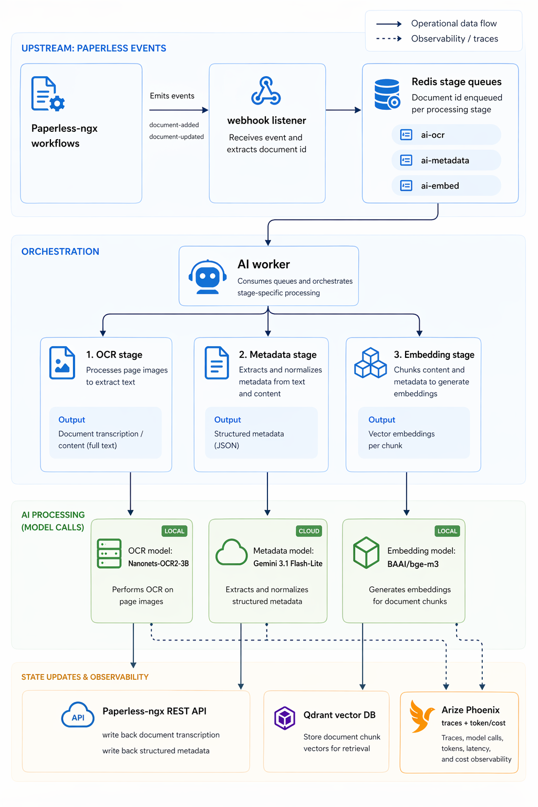
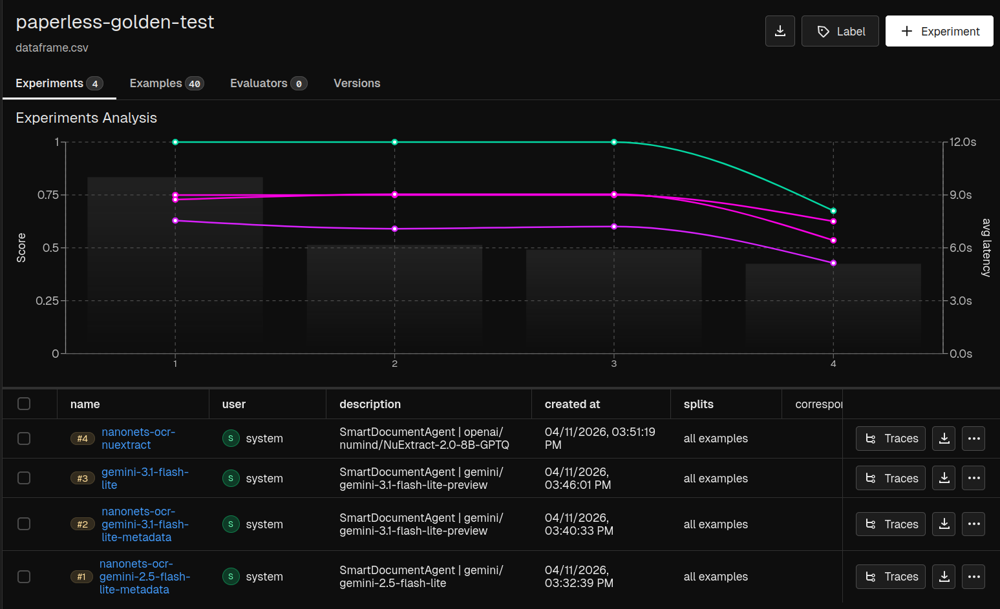
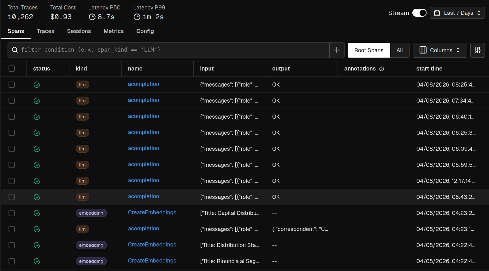

# Deep Dive: Ingestion, RAG, and Observability

This write-up focuses on the ML and retrieval architecture behind the
paperless-ngx AI layer. It complements the [index](index.md), which
is the higher-level summary.

## Architecture

The system is deliberately built around the Paperless API and workflow model.
Paperless remains the source of truth for documents and metadata. The AI layer
is an adjacent service that reacts to workflow tags, moves documents through
independent stages, and writes results back through supported REST APIs.

The separation of models matters because the operational profile of each step is
different. OCR may need a vision-capable model and larger image payloads.
Metadata extraction is usually a smaller text-only call. Embedding is a batch
indexing task. Chat is interactive and must keep latency acceptable. The repo
therefore exposes independent model and API-base settings for OCR, metadata,
and chat.

### Data ingestion

New (or updated) documents are governed by
Paperless stage tags (`ai:run-ocr`, `ai:run-metadata`, `ai:run-embed`) and wait
in Redis until the GPU workstation and local vLLM models are online, which is
managed separately in [docker-vllm](https://github.com/Enucatl/docker-vllm).

The ingestion path is:

1. Paperless imports a document and assigns `ai:run-ocr`.
2. The webhook listener receives the Paperless event and enqueues the document
   ID in Redis.
3. The AI service downloads the original PDF, sends page images to the OCR
   model, and writes the transcript to the Paperless content field.
4. The metadata stage extracts document fields from the transcript and patches
   Paperless metadata.
5. The embedding stage chunks the document, writes vectors to Qdrant, and
   removes the stage tag.

This design accepts delays in return for operational flexibility:
I run the energy-hungry GPU workstation on a weekly schedule to process any new documents with local models.
This keeps running costs minimal, as my personal needs are around 1-2 documents per week.

### Retrieval Design

The search layer is hybrid. During indexing, chunks are written to Qdrant with
named dense vectors from bge-m3-compatible embeddings. At query time,
the shared retrieval pipeline combines:

- dense vector search against Qdrant,
- keyword search through the Paperless API,
- Reciprocal Rank Fusion over dense and keyword document rankings,
- local reranking of chunk candidates with `BAAI/bge-reranker-v2-m3`,
- document-level deduplication after chunk-level scoring.

The browser chat and `/search` endpoint share the retrieval implementation, but
chat can choose precision or recall behavior.
This was introduced after early tests made it clear that there was tension between two types of queries, that needed opposite optimizations:
- "precision"-focused queries ("which (one or few) document(s) has...?")
- "recall"-focused queries ("how many documents about ... can you find?")

So the model has to choose one of the two processes based on the user query before hitting the document database.

The browser chat needs a local embedding and reranker model to achieve good answer quality, but the
GPU workstation that hosts the vision LLM isn't always running. 
Therefore, the system includes a local CPU model (`BAAI/bge-reranker-v2-m3`, ~1GB) that runs on demand.

This model lives in a separate process-backed worker for two reasons:
1. **Keep FastAPI responsive**: Loading and running the reranker is CPU-intensive. Running it in a separate process prevents blocking the main request loop.
2. **Save RAM**: The model weighs ~1-2GB. By launching it lazily on first use and terminating it after 5 minutes of idle time, we avoid keeping memory-heavy models in RAM when no one is using the search feature.

The flow looks like this:
- First query → FastAPI spawns a child process that loads the models (~15s warmup)
- Subsequent queries → reuse the same process for fast reranking (~50ms latency)
- Idle for 5 min → child process exits, reclaiming ~2GB RAM

This gives the best of both worlds: good search quality on CPU when needed, without the cost of keeping heavy models resident all the time (RAM is expensive!).

### Agentic Chat

The chat copilot is a LangGraph-based loop around a LiteLLM chat model. The
agent receives tool schemas and decides when to call them. The available tools
are intentionally narrow:

- `get_available_metadata` returns exact Paperless correspondent, document
  type, storage path, and tag names before filtered searches.
- `search_documents` runs hybrid retrieval with optional metadata filters,
  year filters, limit, and precision/recall mode.
- `read_full_document` reads OCR text for a specific Paperless document when
  the agent needs source detail beyond snippets.

The diagram expands the `search_documents` tool because that is where most of
the RAG-specific work happens: keyword retrieval, dense vector retrieval,
fusion, reranking, and final precision judging.

The `/chat` UI uses a WebSocket endpoint so it can show turn state, tool-call
progress, final answers, and source cards. That makes the system easier to
debug and easier to trust: the user can see when the model searched, what kind
of source it used, and which documents back the answer.

<video src="assets/chat-demo.webm" controls width="100%">
  Chat copilot demo for the tax final bills query.
</video>

The example query asks: "by searching through the tax final bills, show me how
much I paid in federal taxes since 2022". The chat model is Gemini 3.1
flash-lite. For this turn, the agent first inspected available metadata, then
searched documents through the hybrid retrieval pipeline, reranked candidates
locally with `bge-reranker-v2-m3`, decided it needed the full text of three
documents, and then produced the final answer.

This is the intended shape of the agent: the LLM plans and verifies, while
retrieval and reranking stay in deterministic tools. The turn used about 67k
tokens, cost about $0.01, and returned the correct comprehensive answer.

## Evaluation and model choice

The evaluation uses 50 PDFs downloaded from the
[pixparse/idl-wds OCR testing dataset](https://huggingface.co/datasets/pixparse/idl-wds).
The useful detail is that the dataset is already annotated for correspondent
and date, which makes it a good fit for the metadata this pipeline extracts.

Experiments are configured in `ai/src/paperless_ai/eval/experiments.yaml`. The
active comparison covers:

- Gemini 3.1 flash-lite for both OCR and metadata extraction.
- Nanonets-OCR2-3B for OCR, with Gemini 2.5 flash-lite or Gemini 3.1 flash-lite
  for metadata extraction.
- Nanonets-OCR2-3B for OCR, with local NuExtract 8B for metadata extraction.

The evaluation presents four metrics:

- exact date match,
- fuzzy date match,
- fuzzy correspondent match,
- LLM-as-a-judge scoring for the generated title.

The point is to separate strict metadata correctness from useful near misses.
Dates can be exactly right or close; correspondents often differ by suffixes or
word order; titles are better judged semantically than by string equality.

The result was clear enough for an engineering decision. The dedicated OCR
model kept extraction quality stable, and local OCR moved the expensive part of
the pipeline off a hosted model. OCR is roughly 10x more expensive in token
terms than plain text metadata extraction, and the local small OCR model was
about 40% faster in this setup.

Local NuExtract was not adopted. It dropped metadata quality enough that the
privacy and cost benefit did not justify maintaining another local model. The
chosen compromise is local Nanonets OCR plus Gemini 3.1 flash-lite for metadata.

The deployed mix keeps the high-volume work local: OCR runs on Nanonets-OCR2-3B,
and embeddings run locally with the small BAAI/bge-m3 model. Gemini 3.1
flash-lite is used only for metadata extraction over plain text. In a backfill
of about 2,000 documents and roughly 7,000 pages, that kept the Google API cost
below one dollar because page-image OCR and embeddings did not hit the hosted
model API.

Qwen 3.5 9B fit the RTX 5090 hardware and showed promise, but it had a stubborn problem:
when prompted to reason, the model would keep "thinking" — emitting text between
`<thinking>` and `</thinking>` tags — until it exhausted its token budget instead
of closing the section naturally.

The technical fix was straightforward but intrusive: inject custom logic into the
logit generation loop to gradually bias the model toward emitting `</thinking>`
once it hit a predefined token limit. This requires intercepting the generation
stream, modifying probability distributions on-the-fly, and managing state across
generation steps.

I could have implemented that fix, but it would mean carrying custom generation
code in this project — a maintenance burden for a personal pipeline. The chosen
tradeoff was simplicity: use a cloud model (Gemini flash-lite) that works
reliably out of the box, and has quite low cost per token. For a 1-2 documents/week
workload, the extra API cost is negligible compared to the time saved not
maintaining model-specific hacks.

## Observability and Cost Management

Telemetry is exported through OpenTelemetry when `OTEL_EXPORTER_OTLP_ENDPOINT`
is set. The shared telemetry helper instruments LiteLLM and LangChain, and the
application adds spans around retrieval and tool execution. Phoenix then becomes
the shared place to inspect chat turns, model calls, token counts, tool latency,
retrieval sizes, and evaluation experiments.

The LiteLLM and Phoenix integration is especially useful here because it gives
native traceability for LLM calls across providers. The same trace view can show
Gemini calls, OpenAI-compatible local endpoints, token usage, latency, and cost
metadata without a separate tracing adapter for each model API.
