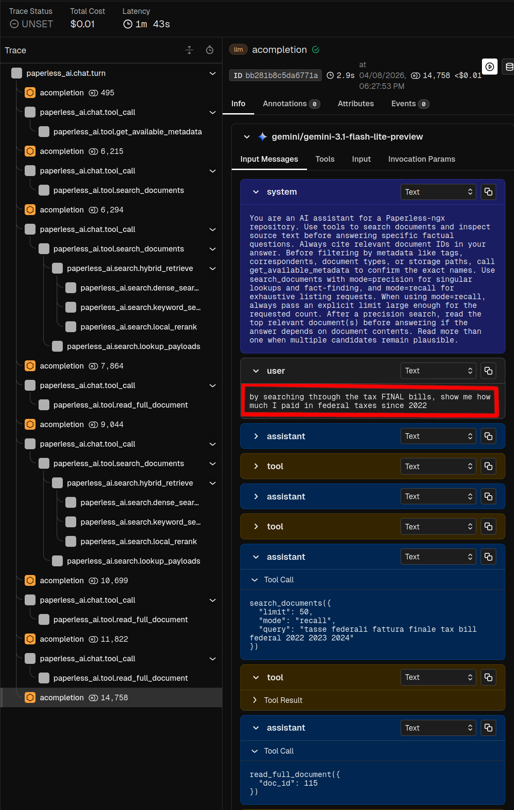
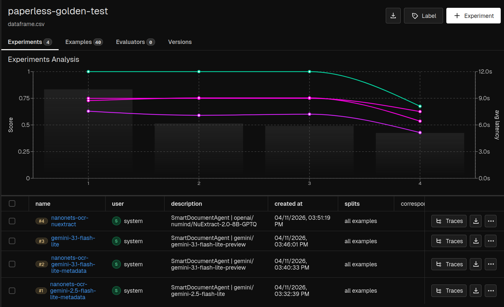
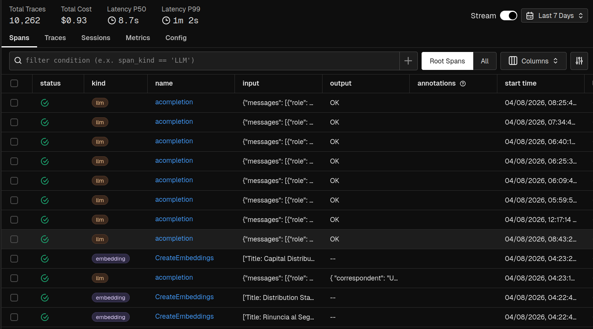

# Deep Dive: Ingestion, RAG, and Observability

This write-up focuses on the ML and retrieval architecture behind the
paperless-ngx AI layer. It complements the [index](index.md), which
is the higher-level summary.

## Architecture

The system is deliberately built around the Paperless API and workflow model.
Paperless remains the source of truth for documents and metadata. The AI layer
is an adjacent service that reacts to workflow tags, moves documents through
independent stages, and writes results back through supported REST APIs.

The separation of models matters because the operational profile of each step is
different. OCR may need a vision-capable model and larger image payloads.
Metadata extraction is usually a smaller text-only call. Chat is interactive
and must keep latency acceptable. The repo therefore exposes independent model
and API-base settings for OCR, metadata, and chat.

### Data ingestion

New (or updated) documents are governed by
Paperless stage tags (`ai:run-ocr`, `ai:run-metadata`) and wait in Redis until
the configured OCR and metadata model endpoints are online.

The ingestion path is:

1. Paperless imports a document and assigns `ai:run-ocr`.
2. The webhook listener receives the Paperless event and enqueues the document
   ID in Redis.
3. The AI service downloads the original PDF, sends page images to the OCR
   model, and writes the transcript to the Paperless content field.
4. The metadata stage extracts document fields from the transcript and patches
   Paperless metadata.
5. The metadata stage removes its stage tag when processing completes.

This design accepts delays in return for operational flexibility:
I run the energy-hungry GPU workstation on a weekly schedule to process any new documents with local models.
This keeps running costs minimal, as my personal needs are around 1-2 documents per week.

### Retrieval Design

Chat search uses Paperless full-text search directly. The LLM is instructed to
use short, distinctive keywords and to retry with simpler or alternate terms
when no results appear. Paperless applies optional correspondent, document type,
storage path, tag, and year filters. Matching document text is returned to the
LLM, which can inspect full documents before answering.

Precision searches default to 20 results; recall searches require an explicit
limit.

### Agentic Chat

The chat copilot is a LangGraph-based loop around a LiteLLM chat model. The
agent receives tool schemas and decides when to call them. The available tools
are intentionally narrow:

- `get_available_metadata` returns exact Paperless correspondent, document
  type, storage path, and tag names before filtered searches.
- `search_documents` runs Paperless full-text search with optional metadata filters,
  year filters, limit, and precision/recall mode.
- `read_full_document` reads OCR text for a specific Paperless document when
  the agent needs source detail beyond snippets.

The `/chat` UI uses a WebSocket endpoint so it can show turn state, tool-call
progress, final answers, and source cards. That makes the system easier to
debug and easier to trust: the user can see when the model searched, what kind
of source it used, and which documents back the answer.

<video src="assets/chat-demo.webm" controls width="100%">
  Chat copilot demo for the tax final bills query.
</video>

The example query asks: "by searching through the tax final bills, show me how
much I paid in federal taxes since 2022". The chat model is Gemini 3.1
flash-lite. For this turn, the agent first inspected available metadata, then
searched documents with Paperless keywords, decided it needed the full text of
three documents, and then produced
the final answer.

This is the intended shape of the agent: the LLM plans and verifies, while
retrieval and relevance filtering stay in deterministic tools. The turn used about 67k
tokens, cost about $0.01, and returned the correct comprehensive answer.

## Evaluation and model choice

The evaluation uses 50 PDFs downloaded from the
[pixparse/idl-wds OCR testing dataset](https://huggingface.co/datasets/pixparse/idl-wds).
The corpus contains document inputs without metadata annotations; Jev judges
the extracted metadata directly from each document's evidence.

Experiments are configured in `ai/src/paperless_ai/eval/experiments.yaml`.
Gemini 3.5 flash-lite remains fixed for OCR and chat while the metadata matrix
compares DeepSeek 4.1 Flash, Inception Mercury 2.5, IBM Granite 4.2 8B, GLM
Flash Latest, Qwen 3.8 Flash, Qwen 3.7 Flash, GPT 5.6 Luna, and Gemma 4 26B
A4B.

The evaluation presents four metrics:

- Jev probability that the date is appropriate,
- Jev probability that the correspondent is appropriate,
- Jev probability that the title is appropriate,
- derived metadata probability and calibrated confidence metrics.

This supports semantic evaluation without requiring a brittle, hand-labelled
reference value for every field.

The evaluation validates the end-to-end extraction and judging path while
holding OCR constant. OCR is roughly 10x more expensive in tokens than plain
text metadata extraction.

The deployed extraction path uses Gemini 3.5 flash-lite for OCR and metadata.
The evaluation's input-only corpus and Jev scores keep model comparisons
separate from production metadata annotations.

Qwen 3.5 9B fit the RTX 5090 hardware and showed promise, but it had a stubborn problem:
when prompted to reason, the model would keep "thinking" — emitting text between
`<thinking>` and `</thinking>` tags — until it exhausted its token budget instead
of closing the section naturally.

The technical fix was straightforward but intrusive: inject custom logic into the
logit generation loop to gradually bias the model toward emitting `</thinking>`
once it hit a predefined token limit. This requires intercepting the generation
stream, modifying probability distributions on-the-fly, and managing state across
generation steps.

I could have implemented that fix, but it would mean carrying custom generation
code in this project — a maintenance burden for a personal pipeline. The chosen
tradeoff was simplicity: use a cloud model (Gemini flash-lite) that works
reliably out of the box, and has quite low cost per token. For a 1-2 documents/week
workload, the extra API cost is negligible compared to the time saved not
maintaining model-specific hacks.

## Observability and Cost Management

Telemetry is exported through OpenTelemetry when `OTEL_EXPORTER_OTLP_ENDPOINT`
is set. The shared telemetry helper instruments LiteLLM and LangChain, and the
application adds spans around retrieval and tool execution. Phoenix then becomes
the shared place to inspect chat turns, model calls, token counts, tool latency,
retrieval sizes, and evaluation experiments.

The LiteLLM and Phoenix integration is especially useful here because it gives
native traceability for LLM calls across providers. The same trace view can show
Gemini calls, OpenAI-compatible local endpoints, token usage, latency, and cost
metadata without a separate tracing adapter for each model API.
