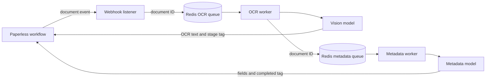
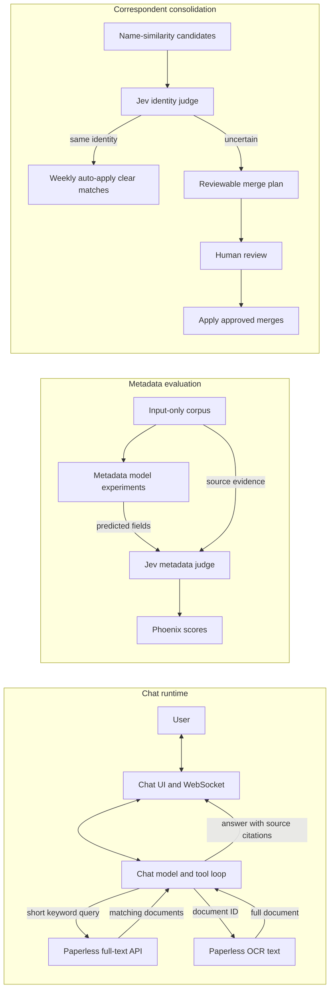

# Deep Dive: Ingestion, Keyword Search, and Evaluation

This write-up describes the current document pipeline, Paperless keyword-search
copilot, and Jev-based metadata evaluation. It complements the
[overview](index.md).

## Architecture

The system is deliberately built around the Paperless API and workflow model.
Paperless remains the source of truth for documents and metadata. The AI layer
is an adjacent service that reacts to workflow tags, moves documents through
independent stages, and writes results back through supported REST APIs.

The separation of models matters because the operational profile of each step is
different. OCR may need a vision-capable model and larger image payloads.
Metadata extraction is usually a smaller text-only call. Chat is interactive
and must keep latency acceptable. The repo therefore exposes independent model
and API-base settings for OCR, metadata, and chat.

### Data ingestion

New (or updated) documents are governed by
Paperless stage tags (`ai:run-ocr`, `ai:run-metadata`) and wait in Redis until
the configured OCR and metadata model endpoints are online.

The ingestion path is:

1. Paperless imports a document and assigns `ai:run-ocr`.
2. The webhook listener receives the Paperless event and enqueues the document
   ID in Redis.
3. The AI service downloads the original PDF, sends selected page images to
   the OCR model, and writes the transcript to Paperless. It OCRs all pages up
   to the configured threshold and only configured first/last pages for longer
   documents.
4. The metadata stage extracts document fields from the transcript and patches
   Paperless metadata.
5. The metadata stage removes its stage tag when processing completes.

Paperless remains the source of truth for full text and metadata. The chat
copilot uses Paperless's existing full-text search; it does not create
embeddings or maintain a vector database.

```mermaid
flowchart LR
    P[Paperless workflow] -->|document event| W[Webhook listener]
    W -->|document ID| OQ[(Redis OCR queue)]
    OQ --> OW[OCR worker]
    OW --> VM[Vision model]
    VM -->|OCR text and stage tag| P
    OW -->|document ID| MQ[(Redis metadata queue)]
    MQ --> MW[Metadata worker]
    MW --> TM[Metadata model]
    TM -->|fields and completed tag| P
```

### Retrieval Design

The model turns a user's question into short, distinctive keywords and calls
Paperless's full-text API. If there are no results, it retries with simpler or
alternate terms. Searches can include exact correspondent, document type,
storage path, tag, and year filters. The tool returns matching OCR snippets;
the model can read selected documents in full before answering.

Precision searches default to 20 results; recall searches require an explicit
limit. There is no embedding, vector-search, or reranking stage.

### Agentic Chat

The chat copilot runs a tool-calling loop through the shared inference client. The model
chooses among three narrow Paperless tools:

- `get_available_metadata` returns exact Paperless correspondent, document
  type, storage path, and tag names before filtered searches.
- `search_documents` runs Paperless full-text search with optional metadata filters,
  year filters, limit, and precision/recall mode.
- `read_full_document` reads OCR text for a specific Paperless document when
  the agent needs source detail beyond snippets.

The `/chat` UI uses a WebSocket endpoint so it can show turn state, tool-call
progress, final answers, and source cards. That makes the system easier to
debug and easier to trust: the user can see when the model searched, what kind
of source it used, and which documents back the answer.

```mermaid
flowchart LR
    subgraph Chat runtime
        U[User] <--> UI[Chat UI and WebSocket]
        UI <--> C[Chat model and tool loop]
        C -->|short keyword query| S[Paperless full-text API]
        S -->|matching documents| C
        C -->|document ID| R[Paperless OCR text]
        R -->|full document| C
        C -->|answer with source citations| UI
    end

    subgraph Metadata evaluation
        D[Input-only corpus] --> X[Metadata model experiments]
        X -->|predicted fields| J[Jev metadata judge]
        D -->|source evidence| J
        J --> F[Phoenix scores]
    end

    subgraph Correspondent consolidation
        Pairs[Name-similarity candidates] --> CJ[Jev identity judge]
        CJ -->|same identity| Auto[Weekly auto-apply clear matches]
        CJ -->|uncertain| Plan[Reviewable merge plan]
        Plan --> Review[Human review]
        Review --> Apply[Apply approved merges]
    end
```

The example asks how much was spent on Google Cloud in 2026. The copilot searches
Paperless, reads matching invoices, and returns the total through August with
source cards. Retrieval is Paperless keyword search.

## Evaluation and correspondent matching

The evaluation corpus contains 50 input-only scanned documents from the
[pixparse/idl-wds dataset](https://huggingface.co/datasets/pixparse/idl-wds). Each
configured metadata model processes the same documents while OCR and chat
models stay fixed. Jev judges extracted fields against source evidence; these
scores are model judgments, not manually annotated ground truth.

Jev also powers correspondent identity matching in the cleanup workflow: a
deterministic name-similarity pass proposes pairs, then Jev judges whether each
pair represents the same identity. Weekly cleanup applies clear matches;
uncertain pairs go through the review plan. Ordinary per-document correspondent
assignment uses the deterministic name resolver.

Jev does not rank chat search results or answer user queries. The copilot uses
Paperless keyword search as described above. See the
[evaluation report](phoenix-paperless-eval-test-report.md) for the measured
metadata model comparison and its limitations.

## Observability and Cost Management

Telemetry is exported through OpenTelemetry when `OTEL_EXPORTER_OTLP_ENDPOINT`
is set. The shared telemetry helper instruments LangChain, and the application
adds spans around chat turns, retrieval, and tool execution. Phoenix shows these
spans and evaluation experiments. Token usage appears when a provider returns it.

The shared inference client routes model calls to OpenRouter or configured
OpenAI-compatible endpoints.
