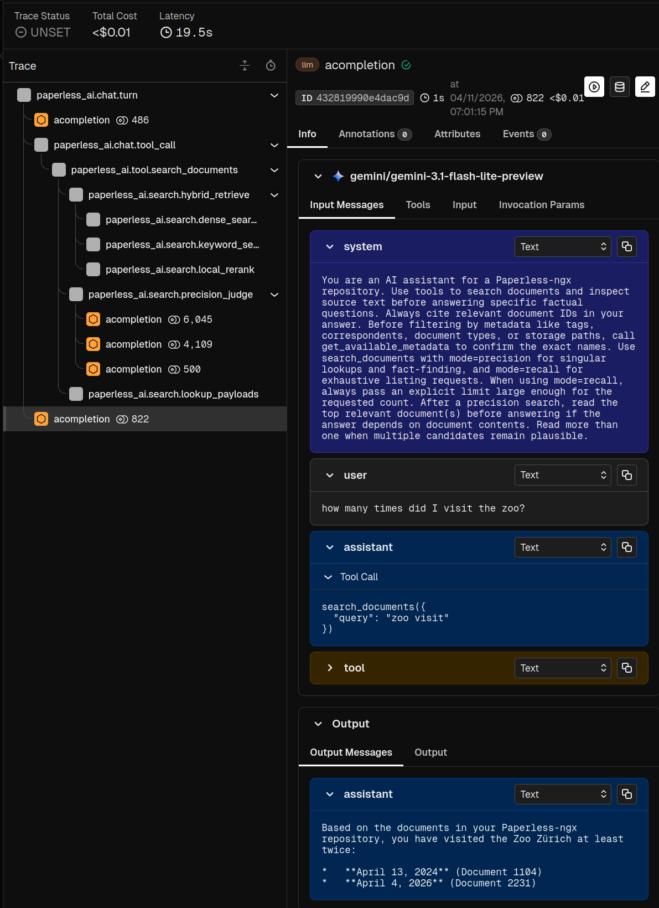

# Case Study: AI Document Copilot for paperless-ngx

This project turns a paperless-ngx archive into an AI-searchable document
system without patching paperless-ngx itself. New documents are imported through
the normal Paperless flow, then an external AI service re-OCRs the pages,
extracts structured metadata, indexes the content for semantic retrieval, and
serves a browser copilot (and API endpoint) that can search, inspect, and
answer questions over the archive with a modern agentic architecture.

It supports both cloud and self-hosted
models, and makes model quality visible through evaluation and tracing.

The example query asks the copilot to search my recent tickets from the zoo.
The Gemini 3.1 flash-lite chat model
inspects available metadata, searches through the hybrid retrieval pipeline,
uses local `bge-reranker-v2-m3` reranking, reads three documents in full, and
then returns a correct comprehensive answer. This costs less than one cent, and is fully traced by arize phoenix.

## What It Does

- OCRs imported documents with a vision model and writes the transcript back
  to Paperless.
- Extracts title, date, correspondent, summary, and structured debug output via
  a metadata LLM.
- Indexes document chunks in Qdrant with dense `bge-m3` vectors.
- Provides a `/search` endpoint for ranked document IDs.
- Provides a browser chat copilot that can call tools, search the archive, read
  source text, and return source-backed answers.
- Leverages modern frameworks to provide cloud and local model compatibility (LiteLLM) and first-class observability and evaluation (Arize Phoenix)

Learn more in the [deep dive](deep-dive.md)
