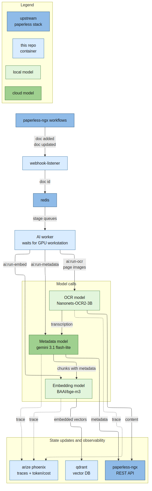

# Case Study: AI Document Copilot for paperless-ngx

<video src="assets/chat-demo.webm" controls width="100%">
  Chat copilot demo for the tax final bills query.
</video>

This project turns a paperless-ngx archive into an AI-searchable document
system without patching paperless-ngx itself. New documents are imported through
the normal Paperless flow, then an external AI service re-OCRs the pages,
extracts structured metadata, indexes the content for semantic retrieval, and
serves a browser copilot that can search, inspect, and answer questions over the
archive.

The goal was not just to attach an LLM to a document store. The useful product
boundary was a dependable local deployment that can process private documents,
recover when a model server is unavailable, support both cloud and self-hosted
models, and make model quality visible through evaluation and tracing.

The example query asks the copilot to search final tax bills and summarize how
much was paid in federal taxes since 2022. The Gemini 3.1 flash-lite chat model
inspects available metadata, searches through the hybrid retrieval pipeline,
uses local `bge-reranker-v2-m3` reranking, reads three documents in full, and
then returns a correct comprehensive answer. That turn used about 67k tokens
and cost about one cent.

## What It Does

- Re-OCRs imported documents with a vision model and writes the transcript back
  to Paperless.
- Extracts title, date, correspondent, summary, and structured debug output via
  a metadata model.
- Indexes document chunks in Qdrant with dense and sparse bge-m3 vectors.
- Provides a `/search` endpoint for ranked document IDs.
- Provides a browser chat copilot that can call tools, search the archive, read
  source text, and return source-backed answers.
- Supports cloud models through LiteLLM and local OpenAI-compatible endpoints
  such as vLLM.
- Exports tracing to Phoenix and includes a Phoenix-backed evaluation workflow
  for OCR and metadata extraction experiments.

## Architecture

The system is deliberately built around the Paperless API and workflow model.
Paperless remains the source of truth for documents and metadata. The AI layer
is an adjacent service that reacts to workflow tags, moves documents through
independent stages, and writes results back through supported REST APIs.

Document processing is offline-friendly: new documents are governed by
Paperless stage tags (`ai:run-ocr`, `ai:run-metadata`, `ai:run-embed`) and wait
in Redis until the GPU workstation and local vLLM models are online, which is
managed separately in [docker-vllm](https://github.com/Enucatl/docker-vllm).

The ingestion path is:

1. Paperless imports a document and assigns `ai:run-ocr`.
2. The webhook listener receives the Paperless event and enqueues the document
   ID in Redis.
3. The AI service downloads the original PDF, sends page images to the OCR
   model, and writes the transcript to the Paperless content field.
4. The metadata stage extracts document fields from the transcript and patches
   Paperless metadata.
5. The embedding stage chunks the document, writes vectors to Qdrant, and
   removes the stage tag.

This design accepts eventual consistency in exchange for operational isolation:
if a local GPU workstation or model endpoint is down, the worker can defer work
without corrupting Paperless state or blocking normal document ingestion.

## Why Evaluation Was Central

The project reached maturity because model choice was treated as an empirical
question. OCR and metadata extraction are easy to demo on a single clean
document, but a personal archive contains scans, forms, letters, dates in many
formats, missing correspondents, and documents where a plausible-looking answer
can still be wrong.

The repo includes a Phoenix-backed evaluation loop over 50 PDFs from the
[pixparse/idl-wds OCR testing dataset](https://huggingface.co/datasets/pixparse/idl-wds).
That dataset is useful because it already includes annotations for
correspondent and date, two of the critical metadata fields this pipeline aims
to extract.

The evaluation reports four complementary metrics: exact date match, fuzzy date
match, fuzzy correspondent match, and an LLM-as-a-judge score for the generated
title. That mix catches strict extraction failures while still giving partial
credit for near misses in dates, organization names, and title wording.

The comparison covered the systems configured in `experiments.yaml`: full cloud
with Gemini 3.1 flash-lite for both OCR and metadata extraction; Nanonets-OCR2-3B
for OCR with two Gemini metadata variants; and a fully local metadata path with
NuExtract 8B.

The dedicated local OCR model kept quality stable while cutting the expensive
part of the pipeline. OCR costs roughly 10x more tokens than plain text metadata
extraction, and the small local OCR model was about 40% faster in this setup.
NuExtract 8B was a significant quality decline and added another local model to
operate, so it was not worth adopting.

Two Qwen 3.5 9B experiments are left commented in `experiments.yaml`. The model
fit the RTX 5090 hardware, but it tended to think until it ran out of tokens
unless handled with dedicated model-specific code. The practical compromise was
local Nanonets OCR plus Gemini 3.1 flash-lite for metadata extraction.

The final production mix uses local OCR, local embeddings with the small
BAAI/bge-m3 model, and Gemini 3.1 flash-lite for metadata extraction. On a real
backfill of about 2,000 documents and roughly 7,000 pages, the Google API cost
for metadata extraction stayed under one dollar because the expensive OCR and
embedding stages were local.

## Production Engineering Signals

The implementation is structured as a deployable service, not a notebook demo.
Important production-oriented decisions include:

- Separate listener and AI service boundaries: webhook ingress remains thin,
  while long-running inference and chat live in the AI service.
- Redis-backed queues and stage tags: documents can wait safely and retry
  without relying on a single in-process job.
- Failure handling: repeated failures move to a failed queue instead of
  retrying forever.
- Local search process lifecycle: query embedding and reranking models are
  lazy-loaded in a child process and released after an idle timeout to reclaim
  memory.
- API compatibility tests: the test suite documents niquests behavior and
  guards against accidentally introducing httpx-only parameters.
- Docker E2E tests: integration tests run against real Paperless, Redis, and
  Qdrant services.
- Phoenix telemetry: traces cover LLM calls, LangChain/LangGraph execution,
  retrieval, and tool calls where instrumentation is available.
- LiteLLM and Phoenix integration: model calls are natively traceable across
  providers, which makes token usage, latency, and cost visible without writing
  custom tracing code for each model API.

## Portfolio Takeaway

This project is useful as a portfolio piece because it connects applied AI with
the constraints that matter in production: data privacy, model evaluation,
fallback behavior, cost visibility, observability, and integration with an
existing product rather than a greenfield demo. The system demonstrates how to
turn an LLM prototype into a maintainable workflow around real documents and
real operational failure modes.
