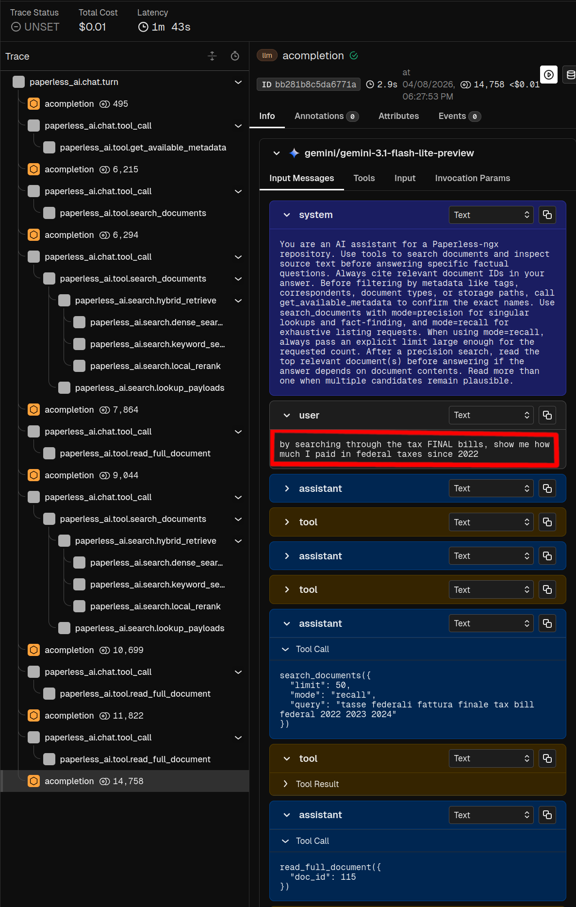

# Case Study: AI Document Copilot for paperless-ngx

<video src="assets/chat-demo.webm" controls width="100%">
  Chat copilot demo for the tax final bills query.
</video>

This project turns a paperless-ngx archive into an AI-searchable document
system without patching paperless-ngx itself. New documents are imported through
the normal Paperless flow, then an external AI service re-OCRs the pages,
extracts structured metadata, indexes the content for semantic retrieval, and
serves a browser copilot (and API endpoint) that can search, inspect, and
answer questions over the archive with a modern agentic architecture.

It supports both cloud and self-hosted
models, and makes model quality visible through evaluation and tracing.

The example query asks the copilot to search final tax bills and summarize how
much was paid in federal taxes since 2022. The Gemini 3.1 flash-lite chat model
inspects available metadata, searches through the hybrid retrieval pipeline,
uses local `bge-reranker-v2-m3` reranking, reads three documents in full, and
then returns a correct comprehensive answer. This used about 67k tokens
and cost about one cent.

## What It Does

- OCRs imported documents with a vision model and writes the transcript back
  to Paperless.
- Extracts title, date, correspondent, summary, and structured debug output via
  a metadata model.
- Indexes document chunks in Qdrant with dense `bge-m3` vectors.
- Provides a `/search` endpoint for ranked document IDs.
- Provides a browser chat copilot that can call tools, search the archive, read
  source text, and return source-backed answers.
- Supports cloud models through LiteLLM and local OpenAI-compatible endpoints
  such as vLLM.
- Exports tracing to Phoenix and includes a Phoenix-backed evaluation workflow
  for OCR and metadata extraction experiments.

## Production Engineering Signals

The implementation is structured as a deployable service, not a notebook demo.
Important production-oriented decisions include:

- Separate listener and AI service boundaries: webhook ingress remains thin,
  while long-running inference and chat live in the AI service.
- Redis-backed queues and stage tags: documents can wait safely and retry
  without relying on a single in-process job.
- Failure handling: repeated failures move to a failed queue instead of
  retrying forever.
- Local search process lifecycle: query embedding and reranking models are
  lazy-loaded in a child process and released after an idle timeout to reclaim
  memory.
- API compatibility tests: the test suite documents niquests behavior and
  guards against accidentally introducing httpx-only parameters.
- Docker E2E tests: integration tests run against real Paperless, Redis, and
  Qdrant services.
- Phoenix telemetry: traces cover LLM calls, LangChain/LangGraph execution,
  retrieval, and tool calls where instrumentation is available.
- LiteLLM and Phoenix integration: model calls are natively traceable across
  providers, which makes token usage, latency, and cost visible without writing
  custom tracing code for each model API.

## Portfolio Takeaway

This project is useful as a portfolio piece because it connects applied AI with
the constraints that matter in production: data privacy, model evaluation,
fallback behavior, cost visibility, observability, and integration with an
existing product rather than a greenfield demo. The system demonstrates how to
turn an LLM prototype into a maintainable workflow around real documents and
real operational failure modes.
