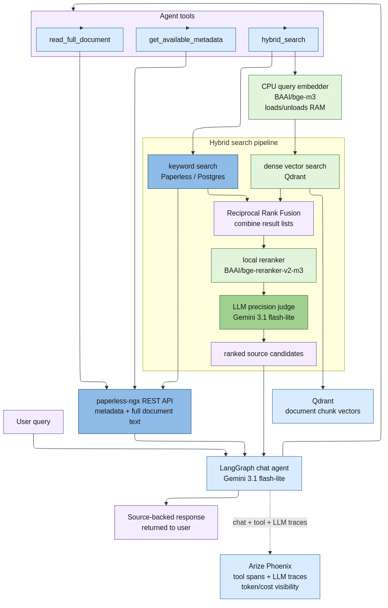

# Technical Deep Dive: Ingestion, RAG, and Observability

This write-up focuses on the ML and retrieval architecture behind the
paperless-ngx AI layer. It complements the [case study](case-study.md), which
is the higher-level portfolio narrative.

## Ingestion Pipeline

The ingestion pipeline starts with Paperless workflows rather than a custom file
watcher. New or backfilled documents enter the AI pipeline by receiving stage
tags such as `ai:run-ocr`, and the webhook listener enqueues the document ID in
Redis.

The tag transitions are shown in the
[data ingestion diagram](data-ingestion-flow.mmd): `ai:run-ocr` moves a document
into OCR, OCR output advances it to `ai:run-metadata`, and metadata extraction
advances it to `ai:run-embed`.

The pipeline stages are independent:

- OCR downloads the original PDF, renders pages, sends page images to the
  configured vision model, and writes the transcript back to Paperless content.
- Metadata extraction reads the transcript from Paperless, extracts structured
  fields, and patches Paperless through the REST API.
- Embedding reads the final content and metadata, chunks the document, embeds
  chunks, and upserts dense and sparse vectors into Qdrant.

The separation matters because the operational profile of each step is
different. OCR may need a vision-capable model and larger image payloads.
Metadata extraction is usually a smaller text-only call. Embedding is a batch
indexing task. Chat is interactive and must keep latency acceptable. The repo
therefore exposes independent model and API-base settings for OCR, metadata,
and chat instead of tying the whole system to one endpoint.

## Model Selection and Evaluation

The evaluation uses 50 PDFs downloaded from the
[pixparse/idl-wds OCR testing dataset](https://huggingface.co/datasets/pixparse/idl-wds).
The useful detail is that the dataset is already annotated for correspondent
and date, which makes it a good fit for the metadata this pipeline extracts.

Experiments are configured in `ai/src/paperless_ai/eval/experiments.yaml`. The
active comparison covers:

- Gemini 3.1 flash-lite for both OCR and metadata extraction.
- Nanonets-OCR2-3B for OCR, with Gemini 2.5 flash-lite or Gemini 3.1 flash-lite
  for metadata extraction.
- Nanonets-OCR2-3B for OCR, with local NuExtract 8B for metadata extraction.

The evaluation presents four metrics:

- exact date match,
- fuzzy date match,
- fuzzy correspondent match,
- LLM-as-a-judge scoring for the generated title.

The point is to separate strict metadata correctness from useful near misses.
Dates can be exactly right or close; correspondents often differ by suffixes or
word order; titles are better judged semantically than by string equality.

The result was clear enough for an engineering decision. The dedicated OCR
model kept extraction quality stable, and local OCR moved the expensive part of
the pipeline off a hosted model. OCR is roughly 10x more expensive in token
terms than plain text metadata extraction, and the local small OCR model was
about 40% faster in this setup.

Local NuExtract was not adopted. It dropped metadata quality enough that the
privacy and cost benefit did not justify maintaining another local model. The
chosen compromise is local Nanonets OCR plus Gemini 3.1 flash-lite for metadata.

The deployed mix keeps the high-volume work local: OCR runs on Nanonets-OCR2-3B,
and embeddings run locally with the small BAAI/bge-m3 model. Gemini 3.1
flash-lite is used only for metadata extraction over plain text. In a backfill
of about 2,000 documents and roughly 7,000 pages, that kept the Google API cost
below one dollar because page-image OCR and embeddings did not hit the hosted
model API.

The commented Qwen 3.5 9B experiments document another rejected path. Qwen fit
the RTX 5090 hardware, but it needed model-specific handling because it tended
to think until it exhausted the token budget. The technical fix is clear: add a
custom module to the logit generation loop that gradually increases the
probability of closing the thinking section by emitting `</thinking>` as a
predefined reasoning limit is reached. I understood and could apply that
technique, but chose not to carry custom generation code in this project. For a
personal document pipeline, the better tradeoff is a stable model stack that
keeps running with minimal intervention.

## Retrieval Design

The search layer is hybrid. During indexing, chunks are written to Qdrant with
named dense and sparse vectors from bge-m3-compatible embeddings. At query time,
the shared retrieval pipeline combines:

- dense vector search against Qdrant,
- keyword search through the Paperless API,
- Reciprocal Rank Fusion over dense and keyword document rankings,
- local reranking of chunk candidates with `BAAI/bge-reranker-v2-m3`,
- document-level deduplication after chunk-level scoring.

The browser chat and `/search` endpoint share the retrieval implementation, but
chat can choose precision or recall behavior. Precision uses a smaller retrieval
surface and can apply an LLM judge to filter candidates. Recall increases the
dense candidate pool and requires the agent to provide an explicit limit for
broader list-style questions.

The local query embedder and reranker run in a process-backed worker. This keeps
the FastAPI process responsive while allowing the memory-heavy local models to
load lazily and exit after an idle timeout.

## Agentic Chat

The chat copilot is a LangGraph-based loop around a LiteLLM chat model. The
agent receives tool schemas and decides when to call them. The available tools
are intentionally narrow:

- `get_available_metadata` returns exact Paperless correspondent, document
  type, storage path, and tag names before filtered searches.
- `search_documents` runs hybrid retrieval with optional metadata filters,
  year filters, limit, and precision/recall mode.
- `read_full_document` reads OCR text for a specific Paperless document when
  the agent needs source detail beyond snippets.

The diagram expands the `search_documents` tool because that is where most of
the RAG-specific work happens: keyword retrieval, dense vector retrieval,
fusion, reranking, and final precision judging.

The `/chat` UI uses a WebSocket endpoint so it can show turn state, tool-call
progress, final answers, and source cards. That makes the system easier to
debug and easier to trust: the user can see when the model searched, what kind
of source it used, and which documents back the answer.

<video src="assets/chat-demo.webm" controls width="100%">
  Chat copilot demo for the tax final bills query.
</video>

The example query asks: "by searching through the tax final bills, show me how
much I paid in federal taxes since 2022". The chat model is Gemini 3.1
flash-lite. For this turn, the agent first inspected available metadata, then
searched documents through the hybrid retrieval pipeline, reranked candidates
locally with `bge-reranker-v2-m3`, decided it needed the full text of three
documents, and then produced the final answer.

This is the intended shape of the agent: the LLM plans and verifies, while
retrieval and reranking stay in deterministic tools. The turn used about 67k
tokens, cost about $0.01, and returned the correct comprehensive answer.

A second Phoenix trace shows a more complex chat turn with a longer agentic
flow. It is useful as an advanced example because the trace contains more tool
calls and makes the control flow between agent decisions, retrieval, source
inspection, and final answer generation easier to inspect.

## Observability and Cost Management

Telemetry is exported through OpenTelemetry when `OTEL_EXPORTER_OTLP_ENDPOINT`
is set. The shared telemetry helper instruments LiteLLM and LangChain, and the
application adds spans around retrieval and tool execution. Phoenix then becomes
the shared place to inspect chat turns, model calls, token counts, tool latency,
retrieval sizes, and evaluation experiments.

The LiteLLM and Phoenix integration is especially useful here because it gives
native traceability for LLM calls across providers. The same trace view can show
Gemini calls, OpenAI-compatible local endpoints, token usage, latency, and cost
metadata without a separate tracing adapter for each model API.

That observability closes the loop between product behavior and model cost. A
chat answer is not just a string; it is a traceable sequence of search, rerank,
read, and model calls. When a model configuration becomes too slow, too
expensive, or too inaccurate, the evaluation and tracing setup provide evidence
for changing that configuration instead of relying on anecdotes.
